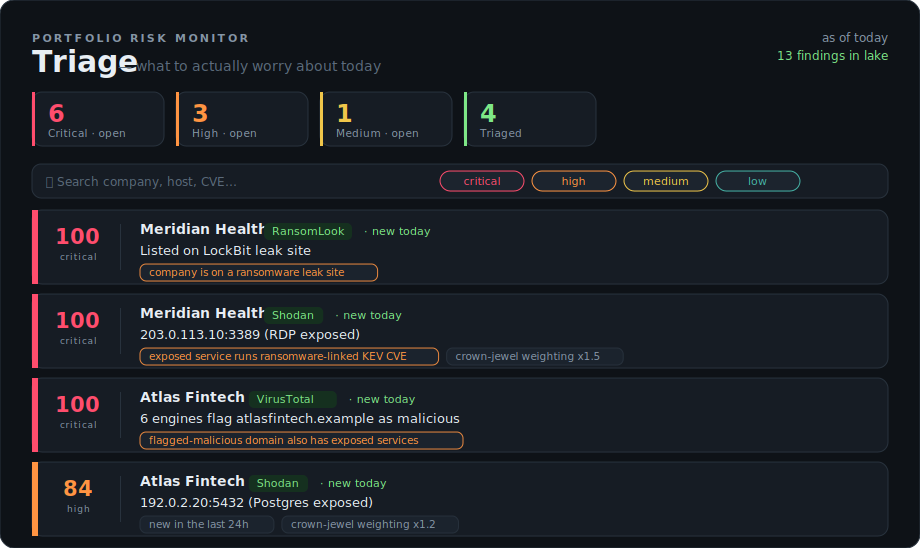
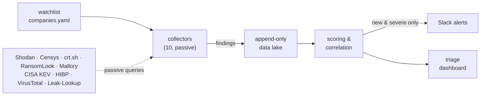

<div align="center">

# securitysight

**Turn a watchlist of companies into a self-updating, prioritized, triageable feed of what you should actually worry about today.**

A free, passive OSINT-derived external attack-surface monitor.

[](https://github.com/jmzf2017/securitysight/actions/workflows/tests.yml)
[](https://github.com/jmzf2017/securitysight/actions/workflows/daily.yml)
[](https://github.com/jmzf2017/securitysight/actions/workflows/weekly.yml)
[](https://www.python.org/)
[](LICENSE)
[](#whats-collected)
[](#security--authorization)



</div>

> [!WARNING]
> **This is the open-source project, and it ships with demo data only** — `config/companies.yaml` uses fake `.example` domains.
>
> **Do not run the scheduled workflows against real companies from a public repo (including a public fork).** They persist the findings lake to a branch, and on a public repository that branch — and any workflow artifacts — are **world-readable**. To monitor real assets, run your own instance from a **private** repo, or switch the lake to private storage (see [`deploy/README.md`](deploy/README.md)). Publishing the *code* is fine; publishing a *lake of real findings about real companies* is not.

---

## The problem

Threat intel for a set of companies is scattered across a dozen tools — Shodan, Censys, certificate logs, ransomware leak sites, breach databases, the CISA KEV catalog. Checking each one for each company, every day, and figuring out which of the hundreds of results actually matters, is a full-time job nobody has time for.

**securitysight** runs that sweep for you. It pulls from those sources *passively*, lands everything in a local append-only data lake, **correlates across sources** to score and explain each finding, alerts Slack only on what's genuinely new and serious, and gives you a dashboard to work the queue.

The difference between this and a pile of API scripts is the correlation: a single exposed Postgres is a shrug; an exposed service running a CISA-KEV-listed CVE, at a company that *also* just showed up on a ransomware leak site, is a fire — and this tells the two apart, and tells you why.

## Highlights

- **10 passive collectors** across exposure, ransomware, breach, credential and vulnerability intel — three work with no API key at all.
- **Append-only data lake.** Observations are never mutated, so "what's new today" is a trustworthy diff and you get a full audit trail.
- **Cross-source scoring that explains itself.** Every score carries plain-English reasons; the ranking is auditable, not a black box.
- **Findings point at a system, not just a product.** A product-level hit (e.g. a KEV matched on your tech tags) is correlated to the actual hosts other collectors located — IP, FQDN and port — so you know *where* to look, with an honest "no public host located" note when nothing matches.
- **Signal-only Slack alerts.** Only newly-seen findings at or above your threshold, never a re-alert on something you've seen.
- **A real triage dashboard.** Rank, filter, acknowledge, dismiss — decisions persist back to the lake.
- **Deploy three ways:** systemd timer, Docker Compose, or serverless GitHub Actions.
- **Privacy-aware.** Leaked credentials are stored as masked samples and counts — never raw `email:password` lines.

## Quickstart

On macOS, `runssp` wraps everything:

```bash
./runssp setup        # one-time: create the venv and install dependencies
cp .env.example .env  # add your API keys (Shodan, Censys, …)
./runssp              # run a collection (no alerts), then open the dashboard
```

Other subcommands: `./runssp run` (collect only), `./runssp dashboard`,
`./runssp test`, `./runssp reset` (start fresh), `./runssp update` (push to both
repos). Run `./runssp --help` for details. You can also drive the engine directly
with `python collectors.py` (see `--help`).


Try it with sample data — **no API keys needed**:

```bash
uv sync                  # or: pip install -r requirements.txt
uv run seed_demo.py      # load realistic sample findings
uv run dashboard.py      # open http://localhost:8000
```

Point it at the real world:

```bash
cp .env.example .env     # add the keys you have; missing ones are skipped
$EDITOR config/companies.yaml          # your watchlist
set -a; source .env; set +a

uv run collectors.py --list            # see the collectors
uv run collectors.py                   # run everything that's ready
uv run collectors.py --collectors shodan   # or just one
uv run collectors.py --dry-run         # preview the Slack post without sending
```

## What's collected

Every collector is **passive** — it queries third-party indexes and public feeds and never touches the watched companies' infrastructure.

| Collector | API key | What it surfaces |
|---|:--:|---|
| **Shodan** | `SHODAN_API_KEY` | internet-exposed services + reported CVEs |
| **Censys** | `CENSYS_PAT` | exposed services (second-opinion corroboration) |
| **crt.sh** | — | new hosts/subdomains via Certificate Transparency |
| **RansomLook** | — | ransomware leak-site victim postings |
| **Mallory-Breaches** | `MALLORY_API_KEY` | breach / dump exposure by domain |
| **Mallory-Vulns** | `MALLORY_API_KEY` | vuln intel with exploit-maturity signal |
| **NVD-KEV** | — | CISA Known Exploited Vulnerabilities catalog |
| **HaveIBeenPwned** | `HIBP_API_KEY` | breached employee accounts on a watched domain |
| **VirusTotal** | `VT_API_KEY` | domain reputation verdicts + passive-DNS resolutions |
| **Leak-Lookup** | `LEAKLOOKUP_API_KEY` | leaked credentials by domain, grouped by source (weekly) |

The three keyless feeds work out of the box. The keyed collectors are real implementations written against each provider's documented API shape — verify field mappings against your own tenant on the first live run, since vendor APIs drift.

## How prioritization works

Scoring runs over the **entire lake** on every pass, so it can correlate across sources rather than scoring each finding in isolation. The escalations that turn noise into signal:

- an exposed service running a **KEV** CVE → critical (ransomware-linked KEV → maxed out)
- a **KEV/vuln matched only on a declared tech tag** → scored by evidence: critical if a located host runs it, medium if a candidate host matches, low/medium "patch-awareness" if no host is found (a tag is your assertion you run something, not proof a vulnerable instance exists)
- any finding at a company **currently on a ransomware leak site** → boosted
- a **new certificate host** that a scanner confirms is **live and exposed** → jumps from info to critical
- a host seen by **multiple scanners** → corroboration bump
- **leaked credentials** (HIBP / Leak-Lookup) + an **exposed remote-access service** → boosted
- a domain **flagged malicious** that also exposes services → reads as a likely compromised host
- plus recency (new today) and per-company **criticality** weighting

A worked example, straight from the demo:

```
100  critical  Meridian Health   Shodan   203.0.113.10:3389 (RDP exposed)
       ↳ exposed service runs ransomware-linked KEV CVE (CVE-2024-21887)
       ↳ company is currently on a ransomware leak site
       ↳ new in the last 24h
       ↳ crown-jewel weighting x1.5
```

Four separate signals — an exposed RDP, a known-exploited CVE on it, the company appearing on a leak site, and its crown-jewel weighting — combine into one unambiguous "deal with this now," with the receipts attached.

## Architecture



The append-only property is the point: observations are immutable, so diffing any two days is trivial and the "new today" feed is trustworthy.

## Configuration

The watchlist is plain YAML. `tags` double as a product/tech inventory that drives KEV and vuln-intel matching; `criticality` floats a crown-jewel company's findings up.

```yaml
companies:
  - name: Meridian Health
    domains: [meridianhealth.example]
    aliases: ["Meridian", "Meridian Health Systems"]
    tags: [citrix, "windows server"]
    criticality: 1.5        # regulated data — weight findings higher
```

## Deployment

Run the daily sweep with no babysitting. Full setup for each is in **[`deploy/README.md`](deploy/README.md)**.

- **systemd timer** — a oneshot service + daily timer (with catch-up) on any Linux host, plus an optional dashboard service.
- **Docker Compose** — an always-on dashboard and a scheduled collector sharing a data volume.
- **GitHub Actions** — serverless daily + weekly schedulers that persist the shared lake to a branch and post a triage table to each run summary. *(Use a private repo — the lake contains findings about your companies.)*

## Extending

Adding a source is small:

1. Drop a module in `pcrm/collectors/`, subclass `BaseCollector`.
2. Set `NAME`, `KEY_ENV`, `CADENCE`, `STATUS`; implement `collect(self, companies) -> list[Finding]`.
3. Register it in `pcrm/registry.py`.
4. Stay passive, and fail soft (catch errors, return what you have).

A `Finding` is source-agnostic — give it a `kind` and a `detail` dict and the lake, scoring and dashboard handle the rest. To make it correlate, reuse an existing `kind` (e.g. `exposed_service`, `breached_accounts`) or add a rule in `pcrm/scoring.py`.

## Project layout

```
collectors.py        CLI (--list, --collectors, --cadence, --dry-run, --no-alert)
dashboard.py         Flask triage dashboard
seed_demo.py         load sample findings to explore offline
config/              watchlist + settings
pcrm/
  models.py          Company, Finding (fingerprint, severity)
  lake.py            append-only JSONL lake + state index
  registry.py        collector registry / --list table
  scoring.py         cross-source correlation & prioritization
  assets.py          locate findings to real hosts (IP/FQDN) + KEV→host link
  pipeline.py        collect → ingest → score → enrich → alert
  collectors/        one module per source
  notify/slack.py    Block Kit alerting
tests/               pytest suite (scoring + redaction)
deploy/              systemd, Docker & GitHub Actions guides + units
.github/workflows/   daily + weekly schedulers (one shared engine)
```

## Security & authorization

> This monitors companies you are **authorized** to monitor — your own organization, portfolio companies, or vendors under agreement.

- **Passive by design.** No scanning, probing, or exploitation of any target. Collectors only read public feeds and third-party indexes.
- **Keys stay in `.env`** (or a secrets manager) and are never committed. Collectors without their key are simply skipped.
- **Credential data is minimized.** Breach/leak findings store counts and masked samples, never plaintext secrets.
- **HIBP** `breacheddomain` lookups only work for domains verified on your own HIBP account — the API enforces the authorization model for you.

## Status

Functional and actively developed (`v0.2`). The collector framework, data lake, cross-source scoring, asset location/correlation, Slack alerting, dashboard, and all three deployment paths work end to end, with a `pytest` suite covering scoring, redaction, and asset correlation. The keyless collectors are exercised directly; the keyed ones are written to each provider's documented API and worth a field check on first live run. See [`CHANGELOG.md`](CHANGELOG.md) for what's new.

## Contributing

Contributions are welcome — especially new collectors and scoring rules. A few ground rules keep the project coherent:

- **Passive only.** No active scanning, probing, brute-forcing, or exploitation of any target. Collectors read public feeds and third-party indexes; that boundary is non-negotiable and PRs that cross it won't be merged.
- **Minimize sensitive data.** Never store raw secrets or unnecessary PII in the lake — follow the existing pattern of counts and masked samples (see the HIBP and Leak-Lookup collectors).
- **Fail soft.** A single collector or API hiccup must never sink a run; catch, record a `collector_error`, and return what you have.

The fastest way in is to add a collector or a correlation rule. See **[CONTRIBUTING.md](CONTRIBUTING.md)** for dev setup, the collector contract, conventions, and how to report a security issue privately.

```bash
uv sync && uv run seed_demo.py && uv run dashboard.py   # get a local instance running in seconds
```

Run the test suite (covers the scoring correlations and credential redaction):

```bash
pip install -r requirements-dev.txt
pytest
```

## License

[MIT](LICENSE).
